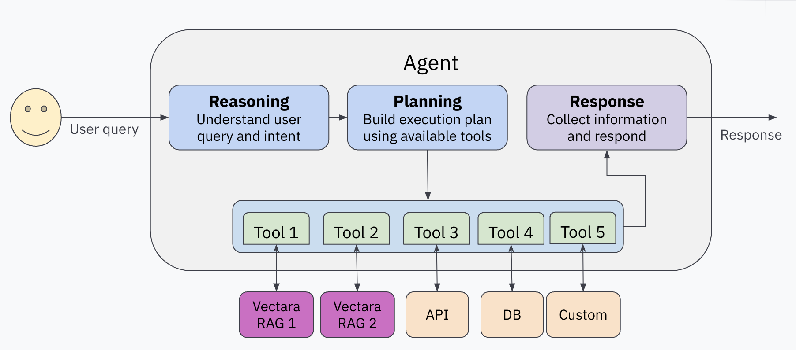

# Getting Started

## Introduction

**What is Agentic RAG?**

Agentic RAG combines retrieval-augmented-generation (RAG) with autonomous agents. While standard RAG retrieves relevant facts and generates responses, Agentic RAG uses an LLM to "manage" the process through reasoning, planning, and tool usage.

With vanilla RAG, Vectara receives a user query, retrieves the most
relevant facts from your data, and uses an LLM to generate the most
accurate response based on those facts. (Unfamiliar with RAG? Check out
this [page](https://vectara.com/retrieval-augmented-generation/) to
learn more!)

Agentic RAG leverages an LLM to "manage" the process of answering the
user query via reasoning, planning, and a provided set of "tools".
Since a "manager" LLM-powered agent is in charge, it is smart enough
to analyze the user query and properly call tools to obtain a
comprehensive response to a complex user query.

For example:

-   The agent can rephrase the user query to fit a certain style, role,
    or persona.
-   The agent can break the query down into multiple (simpler)
    sub-queries and call the RAG query tool for each sub-query, then
    combine the responses to come up with a comprehensive response.
-   The agent can identify filtering criteria in the user query and use
    them to filter the results when using RAG query tool.

The main tool used in vectara-agentic is the `Vectara RAG query tool`,
which queries a Vectara corpus and returns the most relevant response.
By using a RAG-based agent, you mitigate some of the issues with pure
LLMs, particularly hallucinations and explainability.

Another important tool that can be used to query a Vectara corpus is the
`Vectara search tool`, which queries a Vectara corpus for the most
relevant search results and documents that match a query.

Additional tools give your application superpowers to retrieve
up-to-date information, access enterprise specific data via APIs, make
SQL queries to a database, or even perform actions such as creating a
calendar event or sending an email.

Let's demonstrate the advantage of Agentic RAG via a simple example.

Imagine that you have ingested into Vectara all your Google Drive files,
JIRA tickets, and product documentation. You build an Agentic RAG
application using these tools:

1.  A JIRA RAG query tool
2.  A Google Drive RAG query tool
3.  A product docs RAG query tool
4.  A tool that can issue SQL queries against an internal database
    containing customer support data

Consider the query: "What is the top issue reported by customers in the
last 3 months? Who is working to solve it?"

A standard RAG pipeline would try to match this entire query to the most
relevant facts in your data, and generate a response. It may fail to
distinguish the query as two separate questions, and given the
complexity, may fail to produce a good response.

An Agentic RAG assistant would recognize the complexity of the user
query, and decide to act in two steps. First it will form a query with
its SQL tool to identify the top issue reported by customers in the last
3 months, and then it will call the JIRA tool to identify who is working
on that issue from the first query.

**What is vectara-agentic?**

Vectara-agentic is a Python package for building Agentic RAG applications powered by Vectara. It:

- Provides a simple API to define tools, including Vectara RAG tool and Vectara search tool.
- Includes pre-built tools for various domains (legal, finance, etc).
- Integrates with multiple LLM providers (OpenAI, Anthropic, Gemini, Together.AI, Cohere, Bedrock, and GROQ).
- Supports advanced workflows for complex queries.

## Agent Architecture



Vectara-agentic follows a typical agentic RAG architecture. It consists
of the following components:

-   One or more RAG tools for making queries to corpora in Vectara.
-   A set of additional tools that the agent can use to retrieve
    information, process data, or perform actions.
-   A central LLM, or agent (based on `FunctionCalling` or `ReAct` agent type) that manages the process of interpreting
    the user query, creating and executing a plan to collect information
    needed to respond to that query, and crafting a final response.

## Basic Example

Here's a simple example creating an agent with a single RAG tool:

```python
from vectara_agentic.agent import Agent
from vectara_agentic.tools import VectaraToolFactory
from pydantic import Field, BaseModel

import os
from dotenv import load_dotenv

load_dotenv(override=True)

api_key = str(os.environ['VECTARA_API_KEY'])
corpus_key = str(os.environ['VECTARA_CORPUS_KEY'])

vec_factory = VectaraToolFactory(
  vectara_api_key = api_key, 
  vectara_corpus_key = corpus_key
)

ask_pet_policy_tool = vec_factory.create_rag_tool(
    tool_name = "ask_pet_policy",
    tool_description = "Responds to questions about Vectara's pet policy.",
    summary_num_results = 10,
    n_sentences_before = 3,
    n_sentences_after = 3,
    mmr_diversity_bias = 0.1,
    include_citations = False
)

agent = Agent(
    tools = [ask_pet_policy_tool],
    topic = "Vectara Pet Policy"
)

agent.chat("What is Vectara's pet policy?")
```

When we run this code, we get the following response:

> Vectara's pet policy does not allow common household pets like cats
> and dogs on their campuses. Instead, they welcome a select group of
> exotic creatures that reflect their innovative spirit and core values.
> Additionally, birds are not only permitted but encouraged in their
> workspace as part of their unique approach.

In the above code, we defined a single RAG tool (`ask_pet_policy_tool`)
for our `Agent` class, and then created an AI assistant with this tool.

The above code demonstrates the typical flow for instantiating your
`Agent` object when you are defining more than one tool, only in this
case it only used a single tool. Since making a simple assistant like
this with just one RAG tool is a common need, we have provided a single
function that does all of this at once called `from_corpus()`.

Here's how you can create a simple assistant that uses a single RAG
tool for asking questions about Medicare:

``` python
agent = Agent.from_corpus(
  vectara_corpus_key=corpus_key,
  vectara_api_key=api_key,
  data_description="medical plan benefits and pricing",
  assistant_specialty="Medicare",
  tool_name="ask_medicare",
)
```

## Try it Yourself

1. [Create a Vectara account](https://console.vectara.com/signup/?utm_source=github&utm_medium=code&utm_term=DevRel&utm_content=vectara-agentic&utm_campaign=github-code-DevRel-vectara-agentic)
2. Set up environment variables:

**Vectara Corpus:**

`VECTARA_CORPUS_KEY`: The corpus key for the corpus that contains the
Vectara pet policy. You can download the [Pet Policy PDF
file](https://github.com/vectara/example-notebooks/blob/main/data/pet_policy.pdf)
and add it to a new or existing Vectara corpus.

`VECTARA_API_KEY`: An API key that can perform queries on this corpus.

**Agent type, LLMs and model names:**

`VECTARA_AGENTIC_AGENT_TYPE`: Agent type, either FUNCTION_CALLING (default) or REACT.

> **note:** OPENAI agent type has been removed; use FUNCTION_CALLING agent type when using OpenAI as the agent's LLM provider (see `VECTARA_AGENTIC_MAIN_LLM_PROVIDER` below).

`VECTARA_AGENTIC_MAIN_LLM_PROVIDER`: The LLM used for the agent, either
OPENAI (default), ANTHROPIC, GEMINI, TOGETHER, COHERE, BEDROCK, or GROQ.

`VECTARA_AGENTIC_TOOL_LLM_PROVIDER`: The LLM used for the agent tools,
either OPENAI (default), ANTHROPIC, GEMINI, TOGETHER, COHERE, BEDROCK,
or GROQ.

`OPENAI_API_KEY`, `ANTHROPIC_API_KEY`, `GOOGLE_API_KEY`,
`TOGETHER_API_KEY`, `COHERE_API_KEY`, `BEDROCK_API_KEY`, or `GROQ_API_KEY`: Your API key for the agent or tool LLM, if you
choose to use these services.

> **Note:** Fireworks AI support has been removed. If you were using Fireworks, please migrate to one of the supported providers listed above.

With any LLM provider choice, you can also specify the model type to use
via these environment variables:

`VECTARA_AGENTIC_MAIN_MODEL_NAME`: specifies the model name for the main
LLM provider.

`VECTARA_AGENTIC_TOOL_MODEL_NAME`: specifies the model name for the tool
LLM provider.

Defaults:

1.  For `OPENAI`, the default is `gpt-5-mini`.
2.  For `ANTHROPIC`, the default is `claude-sonnet-4-20250514`.
3.  For `GEMINI`, the default is `gemini-2.5-flash`.
4.  For `TOGETHER.AI`, the default is `deepseek-ai/DeepSeek-V3`.
5.  For `COHERE`, the default is `command-a-03-2025`.
6.  For `BEDROCK`, the default is `us.anthropic.claude-sonnet-4-20250514-v1:0`.
7.  For `GROQ`, the default is `openai/gpt-oss-20b`.
